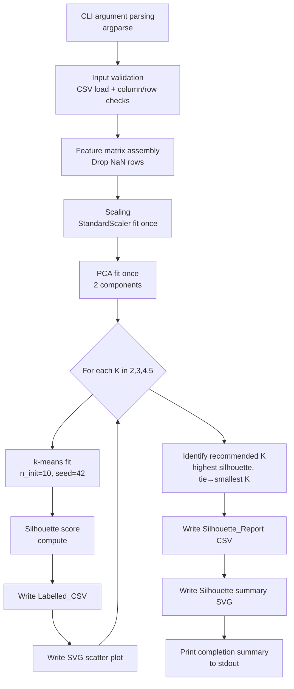

# Design Document

## Overview

`grain_clustering.py` is a standalone, single-file Python script that performs k-means clustering analysis on sediment grain measurement data. It is designed for river confluence sediment studies where researchers compare grain populations from transects taken before and after a confluence point.

The script accepts a single CSV file of per-grain morphological measurements, normalises the feature matrix, runs scikit-learn k-means for k ∈ {2, 3, 4, 5}, evaluates each run with a silhouette coefficient, and produces four types of output: labelled CSVs, a silhouette report CSV, per-k PCA scatter SVGs, and a silhouette bar-chart SVG.

The script has no coupling to the main Sedimental application. It imports only from the Python standard library and the four approved packages: `numpy`, `pandas`, `scikit-learn`, and `matplotlib`.

---

## Architecture

The script follows a linear, single-process pipeline with no external services or databases.



All state flows forward through function return values; there is no global mutable state. The scaler and PCA objects are fitted once before the k-loop and passed into each iteration, guaranteeing identical projections across all k values.

---

## Components and Interfaces

The script is structured as a set of cohesive functions called from a `main()` function, which is invoked under the `if __name__ == "__main__":` guard.

### `parse_args() -> argparse.Namespace`

Parses and validates CLI arguments.

| Argument | Type | Description |
|---|---|---|
| `csv_path` | positional `str` | Path to Input_CSV |
| `--output-dir` | optional `str` | Output directory; defaults to directory of `csv_path` |
| `--dimensions` | optional `nargs='+'` | Subset of the seven dimension names |

Returns a validated `Namespace`. Exits with a non-zero code on invalid arguments (unknown dimension name, fewer than two dimensions).

### `validate_and_load(csv_path, dimensions) -> pd.DataFrame`

Loads the CSV and runs all validation checks in specification order:

1. File existence and readability
2. Selected dimension columns are present
3. Minimum 10 rows
4. NaN row removal with >20 % warning
5. Non-finite / non-numeric value detection

Returns the cleaned DataFrame (NaN rows removed). Exits with a non-zero code on fatal errors, printing to stderr.

### `build_feature_matrix(df, dimensions) -> np.ndarray`

Extracts the selected dimension columns from the cleaned DataFrame and returns a 2-D `float64` NumPy array of shape `(n_valid_grains, n_dimensions)`.

### `fit_scaler(X) -> tuple[StandardScaler, np.ndarray]`

Fits a `sklearn.preprocessing.StandardScaler` on `X`. Checks for zero-variance columns before returning. Returns `(fitted_scaler, X_scaled)`.

### `fit_pca(X_scaled) -> tuple[PCA, np.ndarray]`

Fits a `sklearn.decomposition.PCA(n_components=2)` on `X_scaled`. Returns `(fitted_pca, X_pca)` — the 2-D projection used for all scatter plots.

### `run_kmeans(X_scaled, k) -> tuple[np.ndarray, float]`

Runs `sklearn.cluster.KMeans(n_clusters=k, n_init=10, random_state=42)` on `X_scaled`. Returns `(labels, silhouette_score)`.

### `write_labelled_csv(df_original, valid_mask, labels, k, output_dir, input_stem) -> Path`

Writes a Labelled_CSV. Rows excluded by `valid_mask` receive a cluster label of `-1`. Returns the output path.

### `write_scatter_svg(X_pca, labels, k, silhouette, output_dir, input_stem) -> Path`

Produces a matplotlib figure in SVG format showing PCA scatter with cluster colours, legend, title, and axis labels. Returns the output path.

### `write_silhouette_csv(scores, recommended_k, output_dir, input_stem) -> Path`

Writes the Silhouette_Report CSV with columns `k`, `silhouette_score`, `recommended`. Returns the output path.

### `write_silhouette_svg(scores, recommended_k, output_dir, input_stem) -> Path`

Produces the summary bar-chart SVG. Returns the output path.

### `select_recommended_k(scores: dict[int, float]) -> int`

Pure function. Returns the K with the highest silhouette score; ties broken by smallest K.

### `main()`

Orchestrates the pipeline. Collects output paths and prints the completion summary to stdout.

---

## Data Models

### Input CSV

One row per grain. Must contain at least the columns matching the selected dimensions. Any additional columns are preserved unchanged in Labelled_CSV output.

| Column | Type | Unit |
|---|---|---|
| `area` | float | mm² |
| `perimeter` | float | mm |
| `circularity` | float | dimensionless |
| `roundness` | float | dimensionless |
| `feret_diameter` | float | mm |
| `major_axis` | float | mm |
| `minor_axis` | float | mm |

### Internal State

| Variable | Type | Description |
|---|---|---|
| `df_raw` | `pd.DataFrame` | Full loaded CSV before NaN removal |
| `df_clean` | `pd.DataFrame` | CSV with NaN rows dropped; index preserved |
| `valid_mask` | `pd.Series[bool]` | Boolean mask: `True` for rows included in clustering |
| `X` | `np.ndarray (n, d)` | Raw feature matrix from `df_clean` |
| `X_scaled` | `np.ndarray (n, d)` | z-score normalised feature matrix |
| `X_pca` | `np.ndarray (n, 2)` | PCA projection for plotting |
| `scores` | `dict[int, float]` | Maps K → silhouette score |
| `all_labels` | `dict[int, np.ndarray]` | Maps K → cluster label array (length = n valid grains) |

### Labelled_CSV Schema

All original columns (original order) + `cluster_k{K}` (int64, value ∈ [0, K−1] or -1).

### Silhouette_Report CSV Schema

| Column | Type | Notes |
|---|---|---|
| `k` | int | 2, 3, 4, 5 |
| `silhouette_score` | float | Rounded to 4 decimal places |
| `recommended` | str | `"true"` or `"false"` |

### Output File Naming

| File | Pattern |
|---|---|
| Labelled CSV | `{stem}_clusters_k{K}.csv` |
| Scatter SVG | `{stem}_clusters_k{K}.svg` |
| Silhouette CSV | `{stem}_silhouette.csv` |
| Silhouette SVG | `{stem}_silhouette.svg` |

Where `{stem}` = `Path(csv_path).stem`.

---

## Visualisation Design

### PCA Scatter Plots (per-k)

- **Projection**: 2-D PCA fitted once on `X_scaled`, reused for all k runs.
- **Colours**: `matplotlib.cm.tab10` provides up to 10 qualitatively distinct colours; hue separation between any two colours in `tab10` exceeds 30° in HSL, satisfying the requirement.
- **Legend**: Integer cluster labels 0 … K−1.
- **Title**: `f"k={k} | Silhouette: {score:.4f}"`
- **Axes**: x = "PC1", y = "PC2"
- **Format**: SVG via `fig.savefig(..., format="svg")`

### Silhouette Bar Chart

- **X-axis**: k values {2, 3, 4, 5}, labelled "k"
- **Y-axis**: Silhouette Score, fixed range [−1, 1], labelled "Silhouette Score"
- **Colours**: Recommended k bar uses a highlight colour (e.g., `#2196F3`); non-recommended bars use a neutral colour (e.g., `#90CAF9`).
- **Annotations**: Each bar labelled with its score to 4 decimal places.
- **Title**: "Silhouette Scores by k"

---

## Correctness Properties

*A property is a characteristic or behavior that should hold true across all valid executions of a system — essentially, a formal statement about what the system should do. Properties serve as the bridge between human-readable specifications and machine-verifiable correctness guarantees.*

---

### Property 1: Output directory resolution rule

*For any* combination of `csv_path` (with or without a directory component) and `output_dir` argument (present or absent), the resolved output directory must equal: `output_dir` if supplied; otherwise the parent directory of `csv_path`; and when `csv_path` is a bare filename, the current working directory.

**Validates: Requirements 1.2**

---

### Property 2: Invalid dimension names are always rejected

*For any* string that is not one of the seven valid dimension names (`area`, `perimeter`, `circularity`, `roundness`, `feret_diameter`, `major_axis`, `minor_axis`), passing it as a `--dimensions` argument must cause the script to exit with a non-zero code and the error message must list all seven valid dimension names.

**Validates: Requirements 1.7**

---

### Property 3: Missing columns are detected and named

*For any* subset of the seven dimensions that are absent from the input CSV, the validation step must exit with a non-zero code and the error message must name exactly the missing columns.

**Validates: Requirements 2.2**

---

### Property 4: Row count below minimum is rejected with observed count

*For any* input CSV with fewer than 10 grain rows (after any NaN removal), the script must exit with a non-zero code and the error message must state both the observed row count and the minimum threshold of 10.

**Validates: Requirements 2.3**

---

### Property 5: NaN fraction warning fires exactly at the >20% boundary

*For any* input DataFrame, the script SHALL emit a stderr warning if and only if the fraction of rows dropped due to NaN values strictly exceeds 20%. DataFrames with a NaN fraction ≤ 20% must produce no such warning; DataFrames with a NaN fraction > 20% must produce the warning stating the count and percentage of dropped rows.

**Validates: Requirements 2.4**

---

### Property 6: Non-finite/non-numeric values are reported with exact location

*For any* position of non-finite or non-numeric values in the feature columns of the input DataFrame, the error message must name the column(s) and the 1-based row indices (CSV line numbers) where invalid values appear, and the script must exit with a non-zero code.

**Validates: Requirements 2.5**

---

### Property 7: Scaling produces zero-mean, unit-variance per column

*For any* feature matrix `X` with at least two distinct values per column, after applying `fit_scaler`, each column of the returned `X_scaled` must have a mean of approximately 0 and a standard deviation of approximately 1 (within floating-point tolerance).

**Validates: Requirements 3.1**

---

### Property 8: Scaler and PCA are fitted once and shared across all k runs

*For any* valid input dataset, the `X_scaled` array and the `X_pca` array used as inputs to each k-means run and each scatter plot must be identical across all four k values {2, 3, 4, 5} — i.e., element-wise equality holds between the arrays supplied for k=2 and those supplied for k=3, 4, and 5.

**Validates: Requirements 3.2, 8.2**

---

### Property 9: Clustering is reproducible

*For any* valid input dataset, running the script (or the `run_kmeans` function) twice with the same arguments must produce identical cluster label arrays for every k value.

**Validates: Requirements 4.3**

---

### Property 10: Labelled_CSV structure invariant

*For any* valid input DataFrame, the Labelled_CSV written for a given K must satisfy all of the following simultaneously:
- Contains all rows from the input in their original order (row count preserved).
- Contains all original columns in their original order.
- Has exactly one appended column named `cluster_k{K}` with int64 dtype.
- For every row with complete (non-NaN) dimension values, the `cluster_k{K}` value is an integer in [0, K−1].
- For every row excluded due to missing dimension values, the `cluster_k{K}` value is −1.

**Validates: Requirements 6.2, 6.3, 6.4, 4.4, 4.5**

---

### Property 11: Recommended k is the highest-silhouette k, ties broken by smallest k

*For any* mapping of k ∈ {2, 3, 4, 5} to silhouette scores, `select_recommended_k` must return the k whose score is strictly greatest; when two or more k values share the highest score to four decimal places, it must return the smallest such k.

**Validates: Requirements 5.2, 7.4**

---

### Property 12: Silhouette report has correct structure and values

*For any* valid input dataset, the written Silhouette_Report CSV must contain exactly four data rows with k values [2, 3, 4, 5] in ascending order, each `silhouette_score` value must equal `round(actual_score, 4)`, and exactly one row must have `recommended = "true"` corresponding to the k selected by Property 11.

**Validates: Requirements 7.2, 7.3, 7.4**

---

### Property 13: Scatter SVG legend has exactly K entries

*For any* k ∈ {2, 3, 4, 5}, the matplotlib figure produced by `write_scatter_svg` must contain a legend with exactly K entries, one per cluster label integer in the range [0, K−1].

**Validates: Requirements 8.4**

---

### Property 14: Scatter SVG title matches format string

*For any* k value and silhouette score, the title of the scatter SVG figure must equal the string `f"k={k} | Silhouette: {score:.4f}"`.

**Validates: Requirements 8.5**

---

### Property 15: Silhouette bar chart y-axis is always fixed at [−1, 1]

*For any* set of silhouette scores (regardless of their actual values), the y-axis limits of the silhouette summary bar chart must be exactly −1 (minimum) and +1 (maximum).

**Validates: Requirements 9.1**

---

### Property 16: Bar annotations match scores rounded to 4 decimal places

*For any* set of silhouette scores, each bar in the silhouette summary chart must be annotated with a text string equal to the score rounded to 4 decimal places.

**Validates: Requirements 9.2**

---

### Property 17: Console progress output reflects actual pipeline results

*For any* valid input dataset, the text printed to stdout must accurately reflect: (a) after loading — the actual count of valid grains, the actual count of skipped grains, and the actual dimensions used; (b) after each k run — the correct K and its silhouette score rounded to 4 dp; (c) after completion — every output file path actually written, one per line.

**Validates: Requirements 10.1, 10.2, 10.3**

---

## Error Handling

All error exits follow a consistent pattern:

1. Print a descriptive human-readable message to **stderr**.
2. Call `sys.exit(1)` (or allow argparse to call `sys.exit(2)` for argument errors).
3. Write nothing to stdout for error conditions.

### Error Categories and Handling

| Error | Detection Point | Handler |
|---|---|---|
| Input CSV not found | `validate_and_load` | `sys.exit(1)` after stderr message |
| Input CSV unreadable (permissions) | `validate_and_load` | Catch `PermissionError`, `sys.exit(1)` |
| Missing dimension columns | `validate_and_load` | List missing names, `sys.exit(1)` |
| Fewer than 10 rows | `validate_and_load` | State observed count and threshold, `sys.exit(1)` |
| >20% NaN rows | `validate_and_load` | Warn to stderr, **continue** (not fatal) |
| Non-finite/non-numeric values | `validate_and_load` | List columns and 1-based indices, `sys.exit(1)` |
| Zero-variance column | `fit_scaler` | Name the column, `sys.exit(1)` |
| Invalid dimension name in `--dimensions` | `parse_args` | List all seven valid names, `sys.exit(2)` |
| Fewer than two dimensions in `--dimensions` | `parse_args` | State minimum, `sys.exit(2)` |
| Output directory missing or not writable | `parse_args` / `main` | Describe the path, `sys.exit(1)` |
| K ≥ number of valid grains | `run_kmeans` | State K and grain count, `sys.exit(1)` |
| k-means convergence failure | `run_kmeans` | Catch sklearn warning/exception, `sys.exit(1)` |
| CSV write failure | `write_labelled_csv`, `write_silhouette_csv` | Catch `OSError`, `sys.exit(1)` |
| SVG write failure | `write_scatter_svg`, `write_silhouette_svg` | Catch `OSError`, `sys.exit(1)` |

### NaN Handling Detail

NaN removal happens before the minimum-row check so the minimum-row count is evaluated on clean data. If after NaN removal fewer than 10 rows remain, the script exits with the "fewer than 10 rows" error (reporting the post-removal count).

### Validation Order (Requirement 2.1)

The `validate_and_load` function enforces this exact sequence:
1. Column presence check
2. Minimum row count check (on raw data, before NaN removal)
3. NaN row removal (with optional warning)
4. Post-NaN minimum row count check
5. Non-finite/non-numeric check

This ensures the user receives the most actionable error first.

---

## Testing Strategy

### Approach

This script is a pure data-transformation pipeline with no external services, no UI, and no infrastructure. Its logic consists of numeric transformations, file I/O, and text formatting — all well-suited to property-based testing. PBT is the primary testing strategy.

**Property-based testing library:** `hypothesis` (the standard PBT library for Python, integrates with `pytest`).

**Example-based testing framework:** `pytest`.

**Mocking:** `unittest.mock.patch` for file I/O errors and subprocess-level side-effects.

### Test Configuration

- Minimum **100 iterations** per property test (Hypothesis `settings(max_examples=100)`).
- Each property test tagged with a comment referencing the design property:
  `# Feature: grain-clustering-analysis, Property N: <property text>`

### Property-Based Tests

Each of the 17 correctness properties becomes a `@given`-decorated Hypothesis test. Key generators:

| Generator | Used By |
|---|---|
| `st.floats(allow_nan=False, allow_infinity=False)` | Feature values |
| `st.data_frames(...)` from `hypothesis-pandas` or manual composite strategies | Input DataFrames |
| `st.integers(min_value=0, max_value=6)` | Random NaN row positions |
| `st.floats(min_value=-1.0, max_value=1.0)` | Silhouette scores |
| `st.integers(min_value=2, max_value=5)` | K values |
| `st.text(alphabet=st.characters(blacklist_categories=("Cs",)))` | Invalid dimension name strings |

### Example-Based Unit Tests

Concrete examples for criteria classified as EXAMPLE or for integration checks:

- `test_all_seven_dimensions_default`: omitting `--dimensions` uses all seven.
- `test_four_k_runs_produce_four_outputs`: verify four labelled CSVs and four SVGs exist.
- `test_kmeans_n_init_is_10`: mock KMeans, verify `n_init=10` and `random_state=42`.
- `test_scatter_svg_axis_labels`: verify "PC1" / "PC2" axis labels.
- `test_silhouette_chart_title`: verify "Silhouette Scores by k" title.
- `test_script_has_main_guard`: AST parse and verify `if __name__ == "__main__"`.
- `test_no_project_internal_imports`: AST parse and verify no `sedimental` imports.
- `test_validation_order`: craft a CSV violating multiple constraints, verify first error fires.

### Edge-Case Tests

One test per EDGE_CASE criterion:

- File not found, unreadable (permissions mocked)
- Output directory missing or not writable
- Single dimension supplied (< 2)
- Zero-variance column
- K ≥ valid grain count (e.g., 2 grains with k=3)
- NaN rows constituting exactly 20% (no warning) vs 20.001% (warning fires)
- File write failures (CSV and SVG) via mocked `open` / `savefig`

### Test Organisation

```
analysis/
  grain_clustering.py
tests/
  test_grain_clustering/
    test_cli.py            # CLI parsing, output-dir resolution
    test_validation.py     # Input validation properties + edge cases
    test_normalisation.py  # Scaler properties
    test_clustering.py     # k-means properties, reproducibility, label invariant
    test_silhouette.py     # select_recommended_k property, report structure
    test_outputs.py        # Labelled CSV structure, silhouette CSV structure
    test_visualisation.py  # SVG title, legend count, y-axis range, bar annotation
    test_console.py        # Progress output properties
    test_independence.py   # Smoke tests: imports, __main__ guard
```

### Running Tests

Tests run inside the Docker container (per project testing steering):

```
docker compose run --rm sedimental test tests/test_grain_clustering/ -v
```

For property tests specifically:

```
docker compose run --rm sedimental test tests/test_grain_clustering/test_clustering.py -v
```
