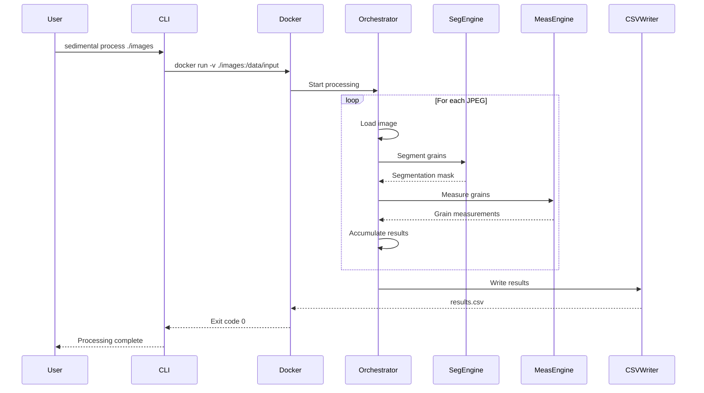
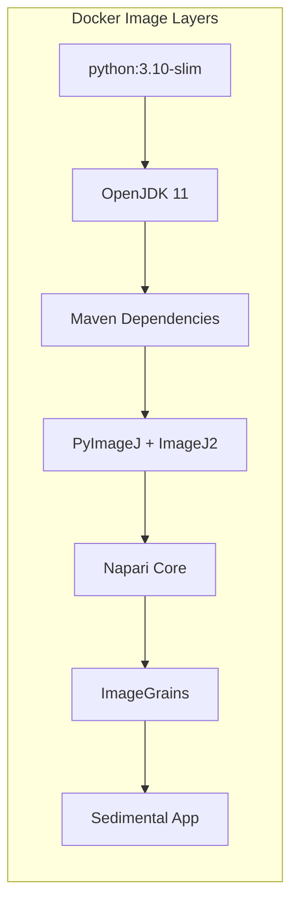

# Design Document: Sedimental Analysis Tool

## Overview

Sedimental is a Docker-first sediment analysis tool that automates the conversion of JPEG images of sediment samples into quantitative grain measurements. The tool integrates ImageGrains for grain segmentation and PyImageJ for particle analysis within a containerized environment, eliminating complex local dependency management.

### Design Philosophy: Docker-First Architecture

Given the complex dependency chains of ImageGrains (Napari plugin ecosystem) and PyImageJ (Java/Maven dependencies, ImageJ2 runtime), this design adopts a **Docker-first approach**:

1. **All processing runs inside Docker containers** - No local Python environment setup required
2. **CLI interface wraps Docker commands** - Users interact with a thin CLI that invokes the containerized processing engine
3. **Web interface runs as a Docker service** - Browser-based access with zero local installation
4. **Development uses Docker Compose** - Consistent environments across development, testing, and production

This approach trades some execution overhead for dramatically simplified deployment and reproducibility.

### Key Design Decisions

| Decision | Rationale |
|----------|-----------|
| Docker-first architecture | ImageGrains requires Napari ecosystem; PyImageJ requires Java/Maven. Containerization isolates these complex dependencies. |
| PyImageJ over direct ImageJ2 | Python-native API simplifies integration with ImageGrains (also Python). Single language runtime in container. |
| Multi-stage Docker build | Separates build dependencies from runtime, reducing final image size from ~4GB to ~2GB. |
| FastAPI for web interface | Async support for concurrent uploads, automatic OpenAPI docs, lightweight. |
| SQLite for job tracking | Simple, file-based, no additional container needed. Persists to mounted volume. |
| Thin CLI wrapper | Local CLI invokes `docker run` commands, avoiding local dependency installation. |

## Architecture

### System Architecture Diagram

```mermaid
graph TB
    subgraph "User Layer"
        CLI[Sedimental CLI<br/>Thin wrapper]
        Browser[Web Browser]
    end
    
    subgraph "Docker Container"
        subgraph "Web Service"
            FastAPI[FastAPI Server]
            JobQueue[Job Queue<br/>SQLite]
        end
        
        subgraph "Processing Engine"
            Orchestrator[Processing Orchestrator]
            SegEngine[Segmentation Engine<br/>ImageGrains]
            MeasEngine[Measurement Engine<br/>PyImageJ]
        end
        
        subgraph "I/O Layer"
            ImageLoader[Image Loader]
            MetadataParser[Metadata Parser]
            CSVWriter[CSV Writer]
            MaskWriter[Mask Writer]
        end
    end
    
    subgraph "Storage (Mounted Volume)"
        InputDir[/data/input]
        OutputDir[/data/output]
        TempDir[/data/temp]
    end
    
    CLI -->|docker run| Orchestrator
    Browser -->|HTTP| FastAPI
    FastAPI --> JobQueue
    FastAPI --> Orchestrator
    
    Orchestrator --> ImageLoader
    Orchestrator --> MetadataParser
    Orchestrator --> SegEngine
    Orchestrator --> MeasEngine
    Orchestrator --> CSVWriter
    Orchestrator --> MaskWriter
    
    ImageLoader --> InputDir
    MetadataParser --> InputDir
    CSVWriter --> OutputDir
    MaskWriter --> OutputDir
    SegEngine --> TempDir
```

### Processing Pipeline



### Container Architecture



## Components and Interfaces

### Component Overview

| Component | Responsibility | Key Dependencies |
|-----------|---------------|------------------|
| `sedimental-cli` | Thin wrapper invoking Docker commands | Docker CLI |
| `ProcessingOrchestrator` | Coordinates pipeline execution | None (pure Python) |
| `ImageLoader` | Validates and loads JPEG images | Pillow |
| `MetadataParser` | Parses and merges metadata JSON | None (stdlib json) |
| `SegmentationEngine` | Grain boundary detection | ImageGrains, scikit-image |
| `MeasurementEngine` | Particle statistics calculation | PyImageJ |
| `CSVWriter` | Results serialization | None (stdlib csv) |
| `MaskWriter` | Segmentation mask output | tifffile |
| `FastAPIServer` | Web interface and job management | FastAPI, uvicorn |
| `JobQueue` | Async job tracking | SQLite |

### Interface Definitions

#### ProcessingOrchestrator

```python
class ProcessingOrchestrator:
    """Coordinates the image processing pipeline."""
    
    def process_single(
        self,
        image_path: Path,
        metadata: Optional[SampleMetadata] = None,
        save_mask: bool = False,
        output_dir: Optional[Path] = None
    ) -> ProcessingResult:
        """Process a single image and return measurements."""
        ...
    
    def process_batch(
        self,
        input_path: Path,
        output_path: Path,
        metadata_path: Optional[Path] = None,
        save_masks: bool = False,
        parallel: bool = False,
        max_workers: int = 4
    ) -> BatchResult:
        """Process all JPEGs in a directory."""
        ...
```

#### SegmentationEngine

```python
class SegmentationEngine:
    """Wraps ImageGrains for grain boundary detection."""
    
    def segment(self, image: np.ndarray) -> SegmentationResult:
        """
        Detect grain boundaries in an image.
        
        Args:
            image: RGB image as numpy array (H, W, 3)
            
        Returns:
            SegmentationResult containing labeled mask and grain count
        """
        ...
    
    def save_mask(self, mask: np.ndarray, output_path: Path) -> None:
        """Save segmentation mask as TIFF with integer labels."""
        ...
```

#### MeasurementEngine

```python
class MeasurementEngine:
    """Wraps PyImageJ for particle measurements."""
    
    def __init__(self):
        """Initialize PyImageJ runtime (expensive, do once)."""
        self._ij = None  # Lazy initialization
    
    def measure(
        self,
        mask: np.ndarray,
        scale_ppm: Optional[float] = None
    ) -> List[GrainMeasurement]:
        """
        Calculate measurements for all labeled grains.
        
        Args:
            mask: Labeled segmentation mask (H, W) with integer labels
            scale_ppm: Pixels per millimeter for unit conversion
            
        Returns:
            List of GrainMeasurement objects, one per grain
        """
        ...
```

#### ImageLoader

```python
class ImageLoader:
    """Validates and loads JPEG images."""
    
    SUPPORTED_EXTENSIONS = {'.jpg', '.jpeg'}
    
    def load(self, path: Path) -> np.ndarray:
        """
        Load and validate a JPEG image.
        
        Raises:
            InvalidImageError: If file is not a valid JPEG
            FileNotFoundError: If file does not exist
        """
        ...
    
    def discover_images(self, directory: Path) -> List[Path]:
        """Find all JPEG files in a directory (non-recursive)."""
        ...
```

#### MetadataParser

```python
class MetadataParser:
    """Parses and merges sample metadata from JSON."""
    
    def parse(self, path: Path) -> MetadataConfig:
        """
        Parse metadata JSON file.
        
        Expected format:
        {
            "default": { ... },
            "images": {
                "sample1.jpg": { ... }
            }
        }
        """
        ...
    
    def get_for_image(
        self,
        config: MetadataConfig,
        image_filename: str
    ) -> SampleMetadata:
        """Get merged metadata for a specific image."""
        ...
```

#### CSVWriter

```python
class CSVWriter:
    """Serializes grain measurements to CSV format."""
    
    COLUMNS = [
        'source_file', 'grain_id', 'area', 'perimeter',
        'circularity', 'roundness', 'feret_diameter',
        'major_axis', 'minor_axis', 'units', 'scale_factor',
        'sample_id', 'location_lat', 'location_lon', 'location_description',
        'capture_date', 'submitted_by'
    ]
    
    def write(
        self,
        results: List[ImageResult],
        output_path: Path
    ) -> None:
        """Write all results to a CSV file."""
        ...
    
    def parse(self, path: Path) -> List[ImageResult]:
        """Parse a results CSV back into structured data."""
        ...
```

#### CLI Wrapper Interface

```python
# sedimental/cli.py - Thin wrapper that invokes Docker

def main():
    """Entry point for sedimental CLI."""
    parser = argparse.ArgumentParser(
        description='Sedimental: Sediment grain analysis tool'
    )
    subparsers = parser.add_subparsers(dest='command')
    
    # Process command
    process_parser = subparsers.add_parser('process')
    process_parser.add_argument('input', help='Image file or directory')
    process_parser.add_argument('-o', '--output', help='Output CSV path')
    process_parser.add_argument('--metadata', help='Metadata JSON file')
    process_parser.add_argument('--save-masks', action='store_true')
    process_parser.add_argument('--scale', type=float, help='Pixels per mm')
    process_parser.add_argument('-v', '--verbose', action='store_true')
    
    # Web command
    web_parser = subparsers.add_parser('web')
    web_parser.add_argument('--port', type=int, default=8080)
    
    args = parser.parse_args()
    
    if args.command == 'process':
        return run_docker_process(args)
    elif args.command == 'web':
        return run_docker_web(args)
```

#### Web API Interface

```python
# FastAPI routes

@app.post("/api/jobs")
async def create_job(
    files: List[UploadFile],
    sample_id: Optional[str] = Form(None),
    location_lat: Optional[float] = Form(None),
    location_lon: Optional[float] = Form(None),
    location_description: Optional[str] = Form(None),
    capture_date: Optional[str] = Form(None),
    scale_ppm: Optional[float] = Form(None),
    submitted_by: Optional[str] = Form(None),
    save_masks: bool = Form(False)
) -> JobResponse:
    """Create a new processing job."""
    ...

@app.get("/api/jobs/{job_id}")
async def get_job_status(job_id: str) -> JobStatus:
    """Get the status of a processing job."""
    ...

@app.get("/api/jobs/{job_id}/results")
async def download_results(job_id: str) -> FileResponse:
    """Download the results CSV for a completed job."""
    ...

@app.get("/api/jobs/{job_id}/masks/{filename}")
async def download_mask(job_id: str, filename: str) -> FileResponse:
    """Download a segmentation mask for a completed job."""
    ...
```


## Data Models

### Core Data Types

```python
from dataclasses import dataclass, field
from datetime import date
from enum import Enum
from pathlib import Path
from typing import Optional, Dict, Any, List
import numpy as np

class MeasurementUnit(Enum):
    """Units for measurements."""
    PIXELS = "pixels"
    MILLIMETERS = "mm"

@dataclass
class SampleMetadata:
    """Metadata associated with a sediment sample."""
    sample_id: Optional[str] = None
    location_lat: Optional[float] = None
    location_lon: Optional[float] = None
    location_description: Optional[str] = None  # e.g., "Colorado River, Mile 42"
    capture_date: Optional[date] = None
    scale_ppm: Optional[float] = None  # pixels per millimeter
    submitted_by: Optional[str] = None  # user who submitted the job (self-reported)
    custom_fields: Dict[str, Any] = field(default_factory=dict)
    
    def merge(self, override: 'SampleMetadata') -> 'SampleMetadata':
        """Merge with another metadata, override takes precedence."""
        return SampleMetadata(
            sample_id=override.sample_id or self.sample_id,
            location_lat=override.location_lat or self.location_lat,
            location_lon=override.location_lon or self.location_lon,
            location_description=override.location_description or self.location_description,
            capture_date=override.capture_date or self.capture_date,
            scale_ppm=override.scale_ppm or self.scale_ppm,
            submitted_by=override.submitted_by or self.submitted_by,
            custom_fields={**self.custom_fields, **override.custom_fields}
        )

@dataclass
class MetadataConfig:
    """Parsed metadata configuration from JSON."""
    default: SampleMetadata
    images: Dict[str, SampleMetadata]  # filename -> metadata

@dataclass
class GrainMeasurement:
    """Measurements for a single grain."""
    grain_id: int
    area: float
    perimeter: float
    circularity: float  # 4π×area/perimeter²
    roundness: float    # 4×area/(π×major_axis²)
    feret_diameter: float
    major_axis: float
    minor_axis: float
    unit: MeasurementUnit
    scale_factor: Optional[float]  # pixels per mm, if converted

@dataclass
class SegmentationResult:
    """Result of grain segmentation."""
    mask: np.ndarray  # (H, W) integer labels, 0 = background
    grain_count: int
    warnings: List[str] = field(default_factory=list)

@dataclass
class ImageResult:
    """Complete results for a single image."""
    source_file: str
    metadata: SampleMetadata
    measurements: List[GrainMeasurement]
    segmentation_mask_path: Optional[Path] = None
    warnings: List[str] = field(default_factory=list)

@dataclass
class ProcessingResult:
    """Result of processing a single image."""
    success: bool
    image_result: Optional[ImageResult] = None
    error: Optional[str] = None

@dataclass
class BatchResult:
    """Result of batch processing."""
    total_images: int
    successful: int
    failed: int
    results: List[ImageResult]
    errors: Dict[str, str]  # filename -> error message
```

### Metadata JSON Schema

```json
{
  "$schema": "http://json-schema.org/draft-07/schema#",
  "type": "object",
  "properties": {
    "default": {
      "$ref": "#/definitions/sampleMetadata"
    },
    "images": {
      "type": "object",
      "additionalProperties": {
        "$ref": "#/definitions/sampleMetadata"
      }
    }
  },
  "definitions": {
    "sampleMetadata": {
      "type": "object",
      "properties": {
        "sample_id": { "type": "string" },
        "location": {
          "type": "object",
          "properties": {
            "lat": { "type": "number", "minimum": -90, "maximum": 90 },
            "lon": { "type": "number", "minimum": -180, "maximum": 180 }
          }
        },
        "capture_date": { 
          "type": "string", 
          "format": "date",
          "description": "ISO 8601 date format (YYYY-MM-DD)"
        },
        "scale_ppm": { 
          "type": "number", 
          "exclusiveMinimum": 0,
          "description": "Pixels per millimeter"
        }
      },
      "additionalProperties": true
    }
  }
}
```

### CSV Output Schema

| Column | Type | Description |
|--------|------|-------------|
| `source_file` | string | Original image filename |
| `grain_id` | integer | Unique grain identifier within image |
| `area` | float | Grain area |
| `perimeter` | float | Grain perimeter |
| `circularity` | float | 4π×area/perimeter² (0-1, 1=circle) |
| `roundness` | float | 4×area/(π×major_axis²) (0-1) |
| `feret_diameter` | float | Maximum caliper diameter |
| `major_axis` | float | Length of major axis |
| `minor_axis` | float | Length of minor axis |
| `units` | string | "pixels" or "mm" |
| `scale_factor` | float | Pixels per mm (null if no scale) |
| `sample_id` | string | Sample identifier from metadata |
| `location_lat` | float | Latitude from metadata |
| `location_lon` | float | Longitude from metadata |
| `location_description` | string | Optional textual location description (e.g., "Colorado River, Mile 42") |
| `capture_date` | string | ISO 8601 date from metadata |
| `submitted_by` | string | User who submitted the job (no authentication, self-reported) |

### Job Queue Schema (SQLite)

```sql
CREATE TABLE jobs (
    id TEXT PRIMARY KEY,
    status TEXT NOT NULL CHECK (status IN ('pending', 'processing', 'completed', 'failed')),
    created_at TIMESTAMP DEFAULT CURRENT_TIMESTAMP,
    updated_at TIMESTAMP DEFAULT CURRENT_TIMESTAMP,
    input_files TEXT NOT NULL,  -- JSON array of filenames
    metadata TEXT,              -- JSON metadata
    save_masks BOOLEAN DEFAULT FALSE,
    result_path TEXT,
    error_message TEXT,
    progress_current INTEGER DEFAULT 0,
    progress_total INTEGER DEFAULT 0
);

CREATE INDEX idx_jobs_status ON jobs(status);
CREATE INDEX idx_jobs_created ON jobs(created_at);
```

### Docker Volume Structure

```
/data/
├── input/           # Mounted input directory (read-only)
│   ├── sample1.jpg
│   ├── sample2.jpg
│   └── metadata.json
├── output/          # Mounted output directory (read-write)
│   ├── results.csv
│   └── masks/
│       ├── sample1_mask.tiff
│       └── sample2_mask.tiff
├── temp/            # Container-internal temp storage
│   └── processing/
└── jobs/            # Web interface job storage
    ├── jobs.db
    └── {job_id}/
        ├── input/
        ├── output/
        └── masks/
```


## Correctness Properties

*A property is a characteristic or behavior that should hold true across all valid executions of a system—essentially, a formal statement about what the system should do. Properties serve as the bridge between human-readable specifications and machine-verifiable correctness guarantees.*

### Property 1: Valid JPEG Acceptance

*For any* valid JPEG image file, the ImageLoader SHALL successfully load it and return a numpy array with shape (H, W, 3) where H > 0 and W > 0.

**Validates: Requirements 1.1**

### Property 2: Directory JPEG Discovery

*For any* directory containing N JPEG files (with extensions .jpg or .jpeg, case-insensitive), the ImageLoader.discover_images() SHALL return exactly N file paths, and all returned paths SHALL have JPEG extensions.

**Validates: Requirements 1.2, 9.1**

### Property 3: Invalid File Error Identification

*For any* corrupted or invalid image file, the ImageLoader SHALL raise an InvalidImageError whose message contains the filename of the problematic file.

**Validates: Requirements 1.3**

### Property 4: Non-JPEG File Filtering

*For any* directory containing a mix of JPEG and non-JPEG files, the ImageLoader.discover_images() SHALL return only files with JPEG extensions, and the count of returned files SHALL equal the count of JPEG files in the directory.

**Validates: Requirements 1.4**

### Property 5: Segmentation Mask Validity

*For any* valid input image, the SegmentationEngine.segment() SHALL produce a SegmentationResult where:
- The mask has the same height and width as the input image
- All values in the mask are non-negative integers
- The grain_count equals the count of unique positive integers in the mask
- Label 0 represents background only

**Validates: Requirements 2.1, 2.2, 2.3**

### Property 6: Mask Persistence on Request

*For any* processing run with save_masks=True, for each successfully processed image, a corresponding TIFF file SHALL exist in the output directory, and the TIFF SHALL contain the same mask data as the SegmentationResult.

**Validates: Requirements 2.4**

### Property 7: Measurement Count Consistency

*For any* segmentation mask with N unique positive labels (grains), the MeasurementEngine.measure() SHALL return exactly N GrainMeasurement objects, and each measurement SHALL have a unique grain_id corresponding to a label in the mask.

**Validates: Requirements 3.1**

### Property 8: Measurement Value Invariants

*For any* GrainMeasurement returned by the MeasurementEngine:
- area > 0
- perimeter > 0
- 0 < circularity <= 1
- 0 < roundness <= 1
- feret_diameter > 0
- major_axis >= minor_axis > 0
- feret_diameter >= major_axis

**Validates: Requirements 3.2, 3.3, 3.4, 3.5, 3.6, 3.7**

### Property 9: Scale Conversion Correctness

*For any* measurement with scale_ppm = S (where S > 0):
- Length measurements (perimeter, feret_diameter, major_axis, minor_axis) in mm SHALL equal pixel_value / S
- Area measurement in mm² SHALL equal pixel_area / S²
- Circularity and roundness SHALL remain unchanged (dimensionless ratios)

**Validates: Requirements 3.8, 10.1, 10.2**

### Property 10: CSV Round-Trip

*For any* list of valid ImageResult objects, writing to CSV via CSVWriter.write() then parsing via CSVWriter.parse() SHALL produce an equivalent list of ImageResult objects (same measurements, same metadata, same source files).

**Validates: Requirements 4.8**

### Property 11: CSV Structure Invariants

*For any* Results_CSV produced by CSVWriter:
- The first row SHALL be a header row containing all required column names
- The number of data rows SHALL equal the total grain count across all processed images
- Every row SHALL have a non-empty source_file value
- Every row SHALL have a scale_factor value (may be null if no scale provided)
- All required columns (area, perimeter, circularity, roundness, feret_diameter, major_axis, minor_axis, units) SHALL be present

**Validates: Requirements 4.2, 4.3, 4.4, 4.5, 4.6, 4.7**

### Property 12: Metadata Auto-Discovery

*For any* input directory containing a file named "metadata.json", when no --metadata argument is provided, the MetadataParser SHALL load and parse that file, and the resulting metadata SHALL be applied to processed images.

**Validates: Requirements 5.1**

### Property 13: Metadata CLI Override

*For any* input directory containing "metadata.json" AND a --metadata argument pointing to a different file, the MetadataParser SHALL use only the file specified by --metadata, ignoring the auto-discovered file.

**Validates: Requirements 5.2**

### Property 14: Metadata Merge Precedence

*For any* MetadataConfig with default metadata D and per-image metadata I for a specific filename:
- Fields present in I SHALL override corresponding fields in D
- Fields present only in D SHALL be preserved
- Fields present only in I SHALL be included
- The merge operation SHALL be idempotent: merge(D, merge(D, I)) == merge(D, I)

**Validates: Requirements 5.3, 5.4, 5.5, 5.6, 5.7, 5.8, 5.9, 5.10**

### Property 15: Metadata JSON Round-Trip

*For any* valid MetadataConfig object, serializing to JSON then parsing SHALL produce an equivalent MetadataConfig (same default values, same per-image overrides).

**Validates: Requirements 5.12**

### Property 16: Malformed Metadata Error

*For any* malformed JSON string (invalid syntax, missing required structure), the MetadataParser.parse() SHALL raise a MetadataParseError whose message describes the parsing failure.

**Validates: Requirements 5.11**

### Property 17: Exit Code Correctness

*For any* CLI invocation:
- If all images process successfully, exit code SHALL be 0
- If any image fails to process AND no images succeed, exit code SHALL be non-zero
- If some images fail but at least one succeeds (partial failure), exit code SHALL be 0 with warnings logged

**Validates: Requirements 6.8, 6.9**

### Property 18: Partial Batch Failure Resilience

*For any* batch of N images where K images fail processing (0 < K < N), the BatchResult SHALL contain:
- successful == N - K
- failed == K
- results list with N - K ImageResult objects
- errors dict with K entries mapping failed filenames to error messages

**Validates: Requirements 9.5**

### Property 19: Batch Result Aggregation

*For any* batch processing of N images producing a total of G grains across all images:
- The Results_CSV SHALL contain exactly G data rows
- The BatchResult.total_images SHALL equal N
- The sum of grain counts across all ImageResults SHALL equal G

**Validates: Requirements 9.2, 9.6**

### Property 20: Units Column Correctness

*For any* Results_CSV:
- If scale_ppm was provided, units column SHALL contain "mm" for all rows
- If no scale_ppm was provided, units column SHALL contain "pixels" for all rows
- All rows in a single CSV SHALL have the same units value

**Validates: Requirements 10.3, 10.4**


## Error Handling

### Error Hierarchy

```python
class SedimentalError(Exception):
    """Base exception for all Sedimental errors."""
    pass

class ImageError(SedimentalError):
    """Errors related to image loading and validation."""
    pass

class InvalidImageError(ImageError):
    """Raised when an image file is corrupted or invalid."""
    def __init__(self, filename: str, reason: str):
        self.filename = filename
        self.reason = reason
        super().__init__(f"Invalid image '{filename}': {reason}")

class UnsupportedFormatError(ImageError):
    """Raised when a file is not a supported image format."""
    def __init__(self, filename: str, detected_format: str):
        self.filename = filename
        self.detected_format = detected_format
        super().__init__(f"Unsupported format '{detected_format}' for file '{filename}'")

class SegmentationError(SedimentalError):
    """Errors during grain segmentation."""
    def __init__(self, filename: str, reason: str):
        self.filename = filename
        self.reason = reason
        super().__init__(f"Segmentation failed for '{filename}': {reason}")

class MeasurementError(SedimentalError):
    """Errors during particle measurement."""
    def __init__(self, filename: str, grain_id: Optional[int], reason: str):
        self.filename = filename
        self.grain_id = grain_id
        self.reason = reason
        super().__init__(f"Measurement failed for '{filename}' grain {grain_id}: {reason}")

class MetadataParseError(SedimentalError):
    """Errors parsing metadata JSON."""
    def __init__(self, path: str, reason: str):
        self.path = path
        self.reason = reason
        super().__init__(f"Failed to parse metadata '{path}': {reason}")

class OutputError(SedimentalError):
    """Errors writing output files."""
    pass
```

### Error Handling Strategy

| Error Type | Handling Strategy | User Feedback |
|------------|-------------------|---------------|
| Invalid JPEG | Skip file, log warning, continue batch | Warning in console, entry in errors dict |
| Non-JPEG file | Skip silently (expected behavior) | Debug log only |
| Segmentation failure | Skip image, log error, continue batch | Error in console, entry in errors dict |
| No grains detected | Log warning, produce empty result for image | Warning in console |
| Measurement failure | Skip grain, log error, continue with other grains | Warning in console |
| Metadata parse error | Fail fast if --metadata specified, warn if auto-discovered | Error message with JSON path and line number |
| Output write failure | Fail with clear error | Error message with path and permission info |
| Docker not available | Fail with installation instructions | Clear error with Docker install link |

### Logging Configuration

```python
import logging
from pathlib import Path

def configure_logging(verbose: bool = False, log_file: Optional[Path] = None):
    """Configure logging for Sedimental."""
    level = logging.DEBUG if verbose else logging.INFO
    
    handlers = [logging.StreamHandler()]
    if log_file:
        handlers.append(logging.FileHandler(log_file))
    
    logging.basicConfig(
        level=level,
        format='%(asctime)s [%(levelname)s] %(name)s: %(message)s',
        handlers=handlers
    )

# Log levels by component
# sedimental.cli: INFO (progress, summary)
# sedimental.loader: WARNING (skipped files)
# sedimental.segmentation: INFO (grain counts), WARNING (no grains)
# sedimental.measurement: DEBUG (per-grain), WARNING (failures)
# sedimental.output: INFO (file written)
```

## Testing Strategy

### Testing Approach

This project uses a dual testing approach:

1. **Unit Tests**: Verify specific examples, edge cases, and error conditions
2. **Property-Based Tests**: Verify universal properties across randomly generated inputs

Both are complementary—unit tests catch concrete bugs and document expected behavior, while property tests verify general correctness across the input space.

### Property-Based Testing Configuration

- **Library**: [Hypothesis](https://hypothesis.readthedocs.io/) for Python
- **Minimum iterations**: 100 per property test
- **Tag format**: `# Feature: sedimental-analysis-tool, Property {N}: {description}`

### Test Organization

```
tests/
├── conftest.py              # Shared fixtures and generators
├── generators/
│   ├── __init__.py
│   ├── images.py            # JPEG image generators
│   ├── masks.py             # Segmentation mask generators
│   ├── metadata.py          # Metadata JSON generators
│   └── measurements.py      # GrainMeasurement generators
├── unit/
│   ├── test_image_loader.py
│   ├── test_metadata_parser.py
│   ├── test_csv_writer.py
│   └── test_measurement_engine.py
├── property/
│   ├── test_image_properties.py      # Properties 1-4
│   ├── test_segmentation_properties.py # Properties 5-6
│   ├── test_measurement_properties.py  # Properties 7-9
│   ├── test_csv_properties.py        # Properties 10-11, 19-20
│   ├── test_metadata_properties.py   # Properties 12-16
│   └── test_cli_properties.py        # Properties 17-18
└── integration/
    ├── test_cli_integration.py
    ├── test_web_integration.py
    └── test_docker_integration.py
```

### Custom Generators

```python
# tests/generators/images.py
from hypothesis import strategies as st
from hypothesis.extra.numpy import arrays
import numpy as np
from PIL import Image
import io

@st.composite
def jpeg_bytes(draw, min_size=10, max_size=500):
    """Generate valid JPEG image bytes."""
    width = draw(st.integers(min_value=min_size, max_value=max_size))
    height = draw(st.integers(min_value=min_size, max_value=max_size))
    
    # Generate random RGB pixel data
    pixels = draw(arrays(
        dtype=np.uint8,
        shape=(height, width, 3),
        elements=st.integers(0, 255)
    ))
    
    # Encode as JPEG
    img = Image.fromarray(pixels, mode='RGB')
    buffer = io.BytesIO()
    img.save(buffer, format='JPEG')
    return buffer.getvalue()

@st.composite
def corrupted_jpeg_bytes(draw):
    """Generate corrupted JPEG-like bytes."""
    valid = draw(jpeg_bytes())
    # Corrupt by truncating or inserting random bytes
    corruption_type = draw(st.sampled_from(['truncate', 'insert', 'overwrite']))
    if corruption_type == 'truncate':
        return valid[:len(valid)//2]
    elif corruption_type == 'insert':
        pos = draw(st.integers(0, len(valid)))
        garbage = draw(st.binary(min_size=10, max_size=100))
        return valid[:pos] + garbage + valid[pos:]
    else:
        pos = draw(st.integers(0, max(0, len(valid)-10)))
        garbage = draw(st.binary(min_size=10, max_size=10))
        return valid[:pos] + garbage + valid[pos+len(garbage):]
```

```python
# tests/generators/masks.py
from hypothesis import strategies as st
from hypothesis.extra.numpy import arrays
import numpy as np

@st.composite
def segmentation_mask(draw, min_grains=0, max_grains=50, min_size=10, max_size=200):
    """Generate a valid segmentation mask with labeled grains."""
    height = draw(st.integers(min_value=min_size, max_value=max_size))
    width = draw(st.integers(min_value=min_size, max_value=max_size))
    num_grains = draw(st.integers(min_value=min_grains, max_value=max_grains))
    
    mask = np.zeros((height, width), dtype=np.int32)
    
    for grain_id in range(1, num_grains + 1):
        # Place a random blob for each grain
        cx = draw(st.integers(5, width - 5))
        cy = draw(st.integers(5, height - 5))
        radius = draw(st.integers(2, min(10, min(cx, cy, width-cx, height-cy))))
        
        y, x = np.ogrid[:height, :width]
        blob = ((x - cx)**2 + (y - cy)**2) <= radius**2
        mask[blob] = grain_id
    
    return mask
```

```python
# tests/generators/metadata.py
from hypothesis import strategies as st
from datetime import date

@st.composite
def sample_metadata(draw):
    """Generate valid SampleMetadata."""
    return SampleMetadata(
        sample_id=draw(st.none() | st.text(min_size=1, max_size=50)),
        location_lat=draw(st.none() | st.floats(min_value=-90, max_value=90)),
        location_lon=draw(st.none() | st.floats(min_value=-180, max_value=180)),
        capture_date=draw(st.none() | st.dates()),
        scale_ppm=draw(st.none() | st.floats(min_value=0.1, max_value=1000)),
        custom_fields=draw(st.dictionaries(
            keys=st.text(min_size=1, max_size=20),
            values=st.text(max_size=100),
            max_size=5
        ))
    )

@st.composite
def metadata_config(draw, filenames: list[str]):
    """Generate valid MetadataConfig for given filenames."""
    default = draw(sample_metadata())
    images = {}
    for filename in filenames:
        if draw(st.booleans()):  # 50% chance of per-image override
            images[filename] = draw(sample_metadata())
    return MetadataConfig(default=default, images=images)
```

### Example Property Test

```python
# tests/property/test_csv_properties.py
from hypothesis import given, settings
import hypothesis.strategies as st
from tests.generators.measurements import grain_measurement, image_result

# Feature: sedimental-analysis-tool, Property 10: CSV Round-Trip
@given(results=st.lists(image_result(), min_size=1, max_size=10))
@settings(max_examples=100)
def test_csv_round_trip(results, tmp_path):
    """
    For any list of valid ImageResult objects, writing to CSV then parsing
    should produce equivalent data.
    """
    csv_path = tmp_path / "results.csv"
    writer = CSVWriter()
    
    # Write
    writer.write(results, csv_path)
    
    # Parse
    parsed = writer.parse(csv_path)
    
    # Verify equivalence
    assert len(parsed) == len(results)
    for original, roundtripped in zip(results, parsed):
        assert original.source_file == roundtripped.source_file
        assert len(original.measurements) == len(roundtripped.measurements)
        for orig_m, rt_m in zip(original.measurements, roundtripped.measurements):
            assert orig_m.grain_id == rt_m.grain_id
            assert abs(orig_m.area - rt_m.area) < 1e-6
            assert abs(orig_m.circularity - rt_m.circularity) < 1e-6
            # ... other fields
```

### Unit Test Examples

```python
# tests/unit/test_image_loader.py
import pytest
from sedimental.loader import ImageLoader, InvalidImageError

class TestImageLoader:
    def test_load_valid_jpeg(self, sample_jpeg_path):
        """Load a known-good JPEG file."""
        loader = ImageLoader()
        image = loader.load(sample_jpeg_path)
        assert image.shape == (100, 100, 3)
        assert image.dtype == np.uint8
    
    def test_load_corrupted_jpeg_raises(self, corrupted_jpeg_path):
        """Corrupted JPEG should raise InvalidImageError with filename."""
        loader = ImageLoader()
        with pytest.raises(InvalidImageError) as exc_info:
            loader.load(corrupted_jpeg_path)
        assert corrupted_jpeg_path.name in str(exc_info.value)
    
    def test_discover_filters_non_jpeg(self, mixed_files_dir):
        """discover_images should return only JPEG files."""
        loader = ImageLoader()
        found = loader.discover_images(mixed_files_dir)
        assert all(p.suffix.lower() in {'.jpg', '.jpeg'} for p in found)
```

### Integration Test Examples

```python
# tests/integration/test_cli_integration.py
import subprocess

def test_cli_process_single_image(sample_image, tmp_path):
    """CLI should process a single image and produce CSV."""
    output_csv = tmp_path / "results.csv"
    
    result = subprocess.run([
        'sedimental', 'process',
        str(sample_image),
        '-o', str(output_csv)
    ], capture_output=True, text=True)
    
    assert result.returncode == 0
    assert output_csv.exists()
    
    # Verify CSV has expected structure
    with open(output_csv) as f:
        header = f.readline()
        assert 'area' in header
        assert 'circularity' in header

def test_cli_batch_with_metadata(sample_dir_with_metadata, tmp_path):
    """CLI should auto-discover metadata.json and apply it."""
    output_csv = tmp_path / "results.csv"
    
    result = subprocess.run([
        'sedimental', 'process',
        str(sample_dir_with_metadata),
        '-o', str(output_csv)
    ], capture_output=True, text=True)
    
    assert result.returncode == 0
    
    # Verify metadata was applied
    import csv
    with open(output_csv) as f:
        reader = csv.DictReader(f)
        row = next(reader)
        assert row['sample_id'] == 'test-sample-001'
```

### Docker Integration Tests

```python
# tests/integration/test_docker_integration.py
import docker
import pytest

@pytest.fixture(scope='module')
def sedimental_container():
    """Start Sedimental container for integration tests."""
    client = docker.from_env()
    container = client.containers.run(
        'sedimental:latest',
        detach=True,
        ports={'8080/tcp': 8080},
        volumes={'/tmp/sedimental-test': {'bind': '/data', 'mode': 'rw'}}
    )
    # Wait for startup
    import time
    time.sleep(10)
    yield container
    container.stop()
    container.remove()

def test_web_upload_and_download(sedimental_container, sample_jpeg_bytes):
    """Upload image via web API and download results."""
    import requests
    
    # Upload
    response = requests.post(
        'http://localhost:8080/api/jobs',
        files={'files': ('test.jpg', sample_jpeg_bytes, 'image/jpeg')},
        data={'sample_id': 'integration-test'}
    )
    assert response.status_code == 200
    job_id = response.json()['job_id']
    
    # Poll for completion
    for _ in range(30):
        status = requests.get(f'http://localhost:8080/api/jobs/{job_id}')
        if status.json()['status'] == 'completed':
            break
        time.sleep(1)
    
    # Download results
    results = requests.get(f'http://localhost:8080/api/jobs/{job_id}/results')
    assert results.status_code == 200
    assert 'area' in results.text
```

