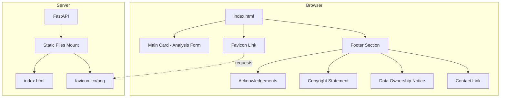

# Technical Design Document: SPA Enhancements

## Overview

This document describes the technical design for enhancing the Sedimental single-page application (SPA) with acknowledgements, contact information, improved coordinate input fields, branding elements (favicon), legal statements, and privacy-respecting activity logging. The implementation modifies the existing `sedimental/static/index.html` file and adds a favicon asset, while maintaining the clean card-based design aesthetic.

### Goals

1. Add proper attribution for ImageJ and ImageGrains open-source projects
2. Provide maintainer contact information
3. Improve coordinate input UX with decimal format guidance and spinner removal
4. Add site branding via favicon
5. Display copyright and data ownership notices
6. Ensure no third-party tracking scripts or cookies are present
7. Maintain visual hierarchy with primary analysis functionality prominent

### Non-Goals

- Backend API changes (all changes are frontend-only except favicon serving)
- User authentication or session management
- Server-side analytics implementation
- Mobile-specific responsive design changes

## Architecture

The SPA enhancements follow a simple frontend-only architecture with one backend consideration for favicon serving.



### Design Decisions

1. **Footer Section Placement**: The footer is placed outside the main `.card` element to maintain visual separation and establish hierarchy. The main analysis form remains the focal point.

2. **Favicon Format**: PNG format is chosen over ICO for better cross-browser support and simpler tooling. SVG could be considered but PNG has broader legacy browser support.

3. **Spinner Removal via CSS**: Using CSS `input::-webkit-outer-spin-button` and `input::-webkit-inner-spin-button` pseudo-elements with `appearance: none` is the most reliable cross-browser approach for hiding number input spinners.

4. **No JavaScript Changes for Validation**: HTML5 `min`, `max`, and `pattern` attributes handle coordinate validation natively. The existing form submission logic already strips empty optional fields.

5. **Inline Styles**: Continuing the existing pattern of inline `<style>` block rather than external CSS file, keeping the SPA self-contained.

## Components and Interfaces

### HTML Structure Changes

#### 1. Head Section Additions

```html
<head>
  <!-- Existing meta tags -->
  <link rel="icon" type="image/png" href="/static/favicon.png">
</head>
```

#### 2. Coordinate Input Modifications

The latitude and longitude inputs are modified to:
- Display decimal format placeholder examples
- Hide browser-native spinners via CSS
- Maintain existing HTML5 validation attributes

```html
<input type="number" id="location_lat" name="location_lat" 
       placeholder="Latitude (e.g., 40.7128)" 
       step="any" min="-90" max="90" 
       class="no-spinner" />

<input type="number" id="location_lon" name="location_lon" 
       placeholder="Longitude (e.g., -74.0060)" 
       step="any" min="-180" max="180" 
       class="no-spinner" />
```

#### 3. Footer Section Structure

```html
<footer class="site-footer">
  <div class="footer-content">
    <!-- Data Ownership Notice -->
    <p class="data-notice">
      All uploaded data and analysis results belong to you. Data may be deleted 
      from this site at any time without notice. Please download your results 
      immediately after processing.
    </p>
    
    <!-- Acknowledgements -->
    <p class="acknowledgements">
      Powered by <a href="https://github.com/imagej/ImageJ" target="_blank" rel="noopener">ImageJ</a> 
      and <a href="https://github.com/dmair1989/imagegrains" target="_blank" rel="noopener">ImageGrains</a>
    </p>
    
    <!-- Copyright and Contact -->
    <p class="copyright">
      © 2026 Nolan Powers. All rights reserved.
    </p>
    <p class="contact">
      <a href="mailto:npowers@umw.edu" aria-label="Contact Nolan Powers at sedimental.io">
        Nolan Powers – sedimental.io
      </a>
    </p>
  </div>
</footer>
```

### CSS Additions

```css
/* Spinner removal for coordinate inputs */
.no-spinner::-webkit-outer-spin-button,
.no-spinner::-webkit-inner-spin-button {
  -webkit-appearance: none;
  margin: 0;
}
.no-spinner {
  -moz-appearance: textfield; /* Firefox */
}

/* Footer styling */
.site-footer {
  max-width: 640px;
  margin: 2rem auto 0;
  padding: 1rem 0;
  text-align: center;
  font-size: 0.8rem;
  color: #666;
}

.site-footer a {
  color: #2563eb;
  text-decoration: none;
}

.site-footer a:hover {
  text-decoration: underline;
}

.data-notice {
  background: #fef3c7;
  border: 1px solid #f59e0b;
  border-radius: 6px;
  padding: 0.75rem;
  margin-bottom: 1rem;
  color: #92400e;
  font-size: 0.8rem;
}

.acknowledgements {
  margin-bottom: 0.5rem;
}

.copyright {
  margin-bottom: 0.25rem;
}

.contact {
  margin-bottom: 0;
}
```

### Favicon Asset

**File**: `sedimental/static/favicon.png`

**Design Requirements**:
- 32x32 pixels (standard favicon size)
- Sediment-related imagery (grain shape, layered strata, or particle cluster)
- Clear visibility at small size
- Transparent background preferred

**Serving**: The existing `StaticFiles` mount at `/static` in `web.py` will automatically serve the favicon. No backend code changes required.

## Data Models

No new data models are required. This feature only modifies the HTML/CSS presentation layer.

## Error Handling

### Coordinate Validation

HTML5 native validation handles coordinate range errors:

| Input | Constraint | Browser Behavior |
|-------|------------|------------------|
| Latitude | `min="-90" max="90"` | Shows validation message, prevents submission |
| Longitude | `min="-180" max="180"` | Shows validation message, prevents submission |

The existing JavaScript form handler already strips empty optional fields, so no changes are needed for empty coordinate handling.

### Favicon Loading Failure

If the favicon fails to load (404), browsers gracefully degrade to showing no favicon or a default icon. No error handling code is needed.

## Testing Strategy

### Why Property-Based Testing Does Not Apply

This feature is **not suitable for property-based testing** because:

1. **UI Rendering**: The requirements primarily concern HTML structure and CSS styling, which are best validated through visual inspection and DOM assertions
2. **Static Content**: Acknowledgements, copyright, and contact information are static text with no input variation
3. **HTML5 Validation**: Coordinate validation uses browser-native HTML5 attributes, not custom validation logic
4. **No Data Transformations**: There are no parsers, serializers, or algorithms that would benefit from randomized input testing

### Recommended Testing Approach

#### 1. Unit Tests (DOM Assertions)

Test the HTML structure using a DOM testing library or simple assertions:

```python
# Example test structure for test_spa_structure.py
def test_footer_contains_imagej_link():
    """Verify ImageJ acknowledgement link is present and correct."""
    # Parse index.html, assert link href and target="_blank"

def test_footer_contains_imagegrains_link():
    """Verify ImageGrains acknowledgement link is present and correct."""

def test_contact_link_mailto():
    """Verify contact link uses correct mailto address."""

def test_coordinate_placeholders():
    """Verify latitude/longitude inputs have decimal format placeholders."""

def test_favicon_link_present():
    """Verify favicon link element exists in head."""

def test_no_google_scripts():
    """Verify no Google tracking scripts are present."""

def test_no_tracking_cookies():
    """Verify no tracking cookie scripts are present."""
```

#### 2. Integration Tests

Test favicon serving through the FastAPI test client:

```python
def test_favicon_served():
    """Verify favicon returns 200 with correct content type."""
    response = client.get("/static/favicon.png")
    assert response.status_code == 200
    assert response.headers["content-type"] == "image/png"
```

#### 3. Manual Visual Testing

- Verify footer appears below main card
- Verify footer text is smaller than main form labels
- Verify spinner controls are hidden on coordinate inputs
- Verify links open in new tabs
- Verify favicon appears in browser tab

#### 4. Accessibility Testing

- Verify contact link has accessible name (`aria-label`)
- Verify external links have `rel="noopener"` for security
- Verify color contrast meets WCAG AA standards

### Test Coverage Matrix

| Requirement | Test Type | Test File |
|-------------|-----------|-----------|
| 1. ImageJ Acknowledgement | Unit (DOM) | `test_spa_structure.py` |
| 2. ImageGrains Acknowledgement | Unit (DOM) | `test_spa_structure.py` |
| 3. Maintainer Contact Link | Unit (DOM) | `test_spa_structure.py` |
| 4. Decimal Format Placeholders | Unit (DOM) | `test_spa_structure.py` |
| 5. Remove Spinners | Manual Visual | - |
| 6. Favicon | Integration | `test_web_api.py` |
| 7. Copyright Statement | Unit (DOM) | `test_spa_structure.py` |
| 8. Data Ownership Notice | Unit (DOM) | `test_spa_structure.py` |
| 9. No Third-Party Tracking | Unit (DOM) | `test_spa_structure.py` |
| 10. Clean Design Aesthetic | Manual Visual | - |

### Validation Constraints (HTML5 Native)

The coordinate inputs rely on HTML5 validation which is tested by browser vendors. Our tests verify the attributes are correctly set:

```python
def test_latitude_validation_attributes():
    """Verify latitude input has correct min/max attributes."""
    # Assert: min="-90", max="90", step="any"

def test_longitude_validation_attributes():
    """Verify longitude input has correct min/max attributes."""
    # Assert: min="-180", max="180", step="any"
```
